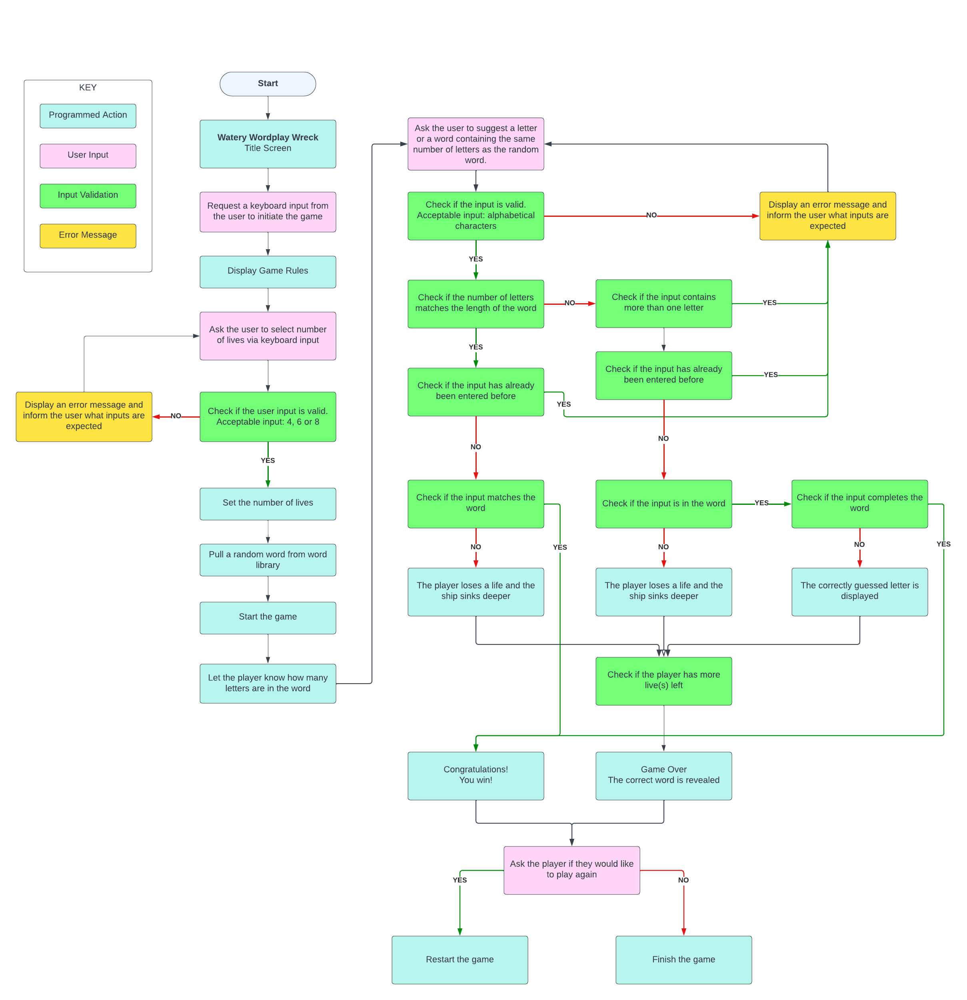

# Watery Wordplay Wreck - My Milestone Project

Welcome to my third milestone project, Watery Wordplay Wreck.

Watery Wordplay Wreck is a word guessing game built with Python. It is a <a href="https://en.wikipedia.org/wiki/Hangman_(game)" target="_blank">Hangman</a> game in the style of a sinking ship to represent the progress of the game.

The user is able to choose the number of lives per game to set the difficulty. By guessing either one letter at a time, or an entire word, the user attempts to guess the correct word before the ship sinks completely. Each failed attempt results in the user losing a life and causes the ship to sink deeper into the sea.

The purpose of this project is to demonstrate my learning and understanding of the Python modules that I have completed thus far and to implement them into a live project. This was a great opportunity to showcase my skills in design and development. The project is a functional terminal application, built from a template provided by <a href="https://github.com/Code-Institute-Org/p3-template" target="_blank">Code Institute</a> combined with my Python code.

Thank you for taking the time to view my project and I truly hope you enjoy it as much as I did designing and developing it.

<a href="https://hcaldwell95.github.io/salt-and-stone-studios/" target="_blank">View live project here</a>

<a href="https://github.com/HCaldwell95/watery-wordplay-wreck" target="_blank">View repository here</a>

## UX - User Experience Design

### User Stories

As a first-time user:
  - I would like to understand how the game works and how to play with ease.
  - I would like to be able to adjust the difficulty to suit my level.
  - I would like instant feedback for each of my guesses while playing the game.
  - I would like to see any letters or words that I have already tried to avoid suggesting them again.
  - I would like to see an error message if my guess is invalid and I would like to be told why.
  - I would like to be able to monitor my progress during the game.
  - I would like to have the option to play the game again or finish my session when the game ends.

As a returning user:
  - I would like to be able to relearn the game quickly and easily.
  - I would like the challenge to remain and encounter different words than my last visit.

## Logic Flow
To plan the logic flow of the game, I created the chart below 

  
## Existing Features

### Title Screen

This is the Title Screen for the game. 

- __Logo__
  - The logo for my project is stamped in the top left corner of the header and is consistent through every page. This serves as a constant reminder of where the user is and promotes connection.

   

  
  
  
  

 

- __Navigation Bar__

The fully responsive navigation bar, featured consistently on all four pages, contains links to the Home, Studios, Team and Contact pages. Its consistency across all pages ensures seamless navigation, regardless of the user's device, eliminating the need to rely on the browser's 'back' button for page transitions. On mobile devices, the navigation bar is nested within a hamburger icon; once clicked, it reveals a dropdown menu, ultimately saving precious screen real estate on smaller devices.

 

 

- __The Landing Page__

  - The Landing Page features a captivating photograph, overlayed with text, offering users a clear sense of the site's relevance to specific locations. This section introduces the website and reassures users that they are in the right place.

   

 

- __About Section__

  - The about section will allow the user to get to know the Studio and its history. This user will see the value of looking further into this website and exploring everything that it has to offer.. This should encourage the user to consider booking time in at our studio or be inspired and get creative.

   

  

- __Quick Links__

  - This section allows the user to quickly navigate to the project's most popular social media pages.

   

  

- __Services Section__

  - The services section provides the user with a brief list of services that the studio provides. This enables the user to quickly determine whether this website is suitable for their needs.

  </a>

- __Experiences Image Grid__

  - This section displays three images and a video, all of which represent the studio in some sense. The first image is of Snowdonia, the area that the studio is based in. The video demonstrates a world-famous musician recording an album in the studio. The final two images are of famous musicians who have used the studios services in the past. This section will both entice and reassure users that this is an authentic website, providing high quality services.

   

  

 

- __The Footer__

- The footer contains a 'Back To The Top!' button, disguised as a simple up arrow icon. There are also four links to the most popular social media websites, along with the studio address and a small emblem representing the studios date of establishment. 
- The footer is consistant throughout the website, allowing users to become familiar with the navigation between pages. The social media features encourage user loyalty as they are able to connect deeper through social media links.

 

 

- __The Studios Page__

  - The studios page provides the user with a run-down of the current set up at the studio. There are links available to the equipment that the studio use, along with detailed information of the capabilities of each studio.
  - This section is valuable to the user as they can determine whether the equipment available suits their needs and they can also learn a little more about said equipment through the links provided to each piece.

   

</a>

- __The Team Page__

  - This page will allow the user to get to know the team. Users can learn more about the artists who established the studio and gain confidence in their abilities. This also provides users with familiarity.

   

</a>

- __The Contact Page__

  - This page displays all means of communication with the studio. There is also a form established to allow the users to communicate with the creators. 

</a>

 

</a>

  - This form will not allow the users to send it until all of the required criteria is met. The user will be prompted to enter the correct details as detailed in the image below:

   

</a>

## Testing

### Further Testing

- The project was tested on the following browsers with success: Google Chrome, Microsoft Edge and Mozilla Firefox.
- The project was manually tested on an iPhone 12 Pro Max, iPhone 13 and iPad Pro 12.9 with success.
- Mozilla Firefox Developer tools were used throughout the project to help test the responsiveness across multiple device options.
- Mozilla Firefox Developer Tools used to emulate screen sizes below:
  - 360px x 640px (Standard Phone)
  - 810px x 1080px (iPad)
  - 1280px x 900px (Laptop)
  - 1440px x 900px (Desktop)

### Validator Testing

I used the  <a href="https://validator.w3.org/">W3C HTML Validator</a> and <a href="https://jigsaw.w3.org/css-validator/">W3C CSS Validator</a> to validate every page of the project to ensure there were no syntax errors in the project.

- No errors were returned when passing through the official <a href="https://validator.w3.org/">W3C Markup Validator</a>.
- No errors were found when passing through the official <a href="https://jigsaw.w3.org/css-validator/">W3C CSS Validator</a>.

### Unfixed Bugs

- I discovered that my CSS didn't quite function well after 1440px and up. In the future, with more experience, I would want to ensure that the website is function no matter the size of the screen.

 

 

- On the Contact Form, due to having the email entry a required element, the CSS which forces the placeholder text up and out of the box during :focus and :valid doesn't function as planned if the user types anything but an email address. After numerous attempts, I decided that this would need to wait until I have more experience, before I am able to correct the CSS to function more effectively.

 
    

## Deployment

#### Github

This project is deployed using GitHub pages using the following process,

#### Deploying a GitHub Repository via GitHub Pages

1. In your <em>Repository</em> section, select the <em>Repository</em> you wish to deploy.
2. In the top horizontal Menu, locate and click the <em>Settings</em> link.
3. Inside the <em>Setting</em> page, around halfway down locate the <em>GitHub Pages</em> Section.
4. Under <em>Source</em>, select the None tab and change it to <em>Main</em> and click <em>Save</em>.
5. Finally once the page resets scroll back down to the <em>GitHub Pages</em> Section to see the following message "Your site is ready to be published at (<em>Link to the GitHub Page Web Address</em>)". It can take time for the link to open your project initially, so please don't be worried if it down not load immediately.

#### Forking the Github Repository

You can fork a GitHub Repository to make a copy of the original repository to view or make changes without it affecting the original repository.

1. Find the GitHub repository.
2. At the top of the page to the right, under your account, click the <em>Fork</em> button.
3. You will now have a copy of the repository in your GitHub account.

#### Making a Local Clone

1. Find the GitHub Repository.
2. <em>Click</em> the Code button
3. <em>Copy</em> the link shown.
4. In <em>Gitpod</em>, change the directory to the location you would like the cloned directory to be located.
5. <em>Type</em> <code>git clone</code>, and <em>paste</em> the link you copied in step 3.
6. Press <em>Enter</em> to have the local clone created.

The live link can be found here - <https://github.com/HCaldwell95/salt-and-stone-studios>

## Credits

#### Code

- <a href="https://codeinstitute.net/">Code Institute, Various Tutors</a>
  - Helped me to find solutions to many of my coding issues/queries and allowed me to refer to specific modules for further guidance.

- <a href="https://www.youtube.com/@OnlineTutorialsYT">Online Tutorials</a>
  - Idea for the contact us page and form taken from their video. <a href="https://www.youtube.com/watch?v=gggB0Nq5vBk&t=654s">Link to video</a>

- <a href="https://www.w3.org/">World Wide Web Consortium (W3C)</a>
  - Provided access to many 'How To' pages, namely the team cards in team.html. Provided specific guide for 'Meet The Team' cards. <a href="https://www.w3schools.com/howto/howto_css_team.asp">Link to page</a>

- <a href="https://www.geeksforgeeks.org/clear-screen-python/" target="_blank">GeeksforGeeks</a>
    - Provided the code for clearing the terminal.

### Media

- <a href="https://patorjk.com/software/taag/#p=testall&f=Slant%20Relief&t=Watery%20Wordplay" target="_blank">Patorjk</a>
    - Provided all of the Ascii Art for the titles throughout the application.

- <a href="https://www.google.co.uk/">Google Images</a>
  - All of my images have been pulled from a google search:
    - https://www.soundonsound.com/people/brendan-perry-quivvy-studio-church-music
    - https://www.visitsnowdonia.info/sites/default/files/styles/home_hero_carousel_1400x600_/public/Llyn%20Llydaw%2C%20Snowdon%20-%20Yr%20Wyddfa%201400%20600.png?itok=QfjqcYiL
    - https://bravewords.com/medias-static/images/news/2015/556DB266-bullet-for-my-valentine-post-venom-studio-diary-part-one-video-image.jpg
    - https://www.telegraph.co.uk/content/dam/music/2015-08/Aug26/Stereophonics.jpg?imwidth=680
    - https://www.pmtonline.co.uk/media/blog/BEST-AUDIO-MIXERS-d.jpg
    - https://media.istockphoto.com/id/1342954577/photo/
    - https://www.insauga.com/alexisonfire-headlines-st-catharines-born-raised-summer-shows/
    - https://i1.pickpik.com/photos/949/859/697/background-black-coffee-coffee-desk-preview.jpg
    - https://www.rawmusictv.com/images/og-share-image/wade-macneil.jpg
    - https://magnetmagazine.com/wp-content/uploads/2023/03/CC-683x1024.jpg
    - https://i.ytimg.com/vi/WnVdSogBNXM/maxresdefault.jpg
  
- <a href="https://ui.dev/amiresponsive?url=https://hcaldwell95.github.io/salt-and-stone-studios/">Am I Responsive?</a> - Provided image used at the top of README.md to demonstrate responsiveness.
 

- <a href="https://www.youtube.com/channel/UCbd18DQEmUApY3vE_N9UYOg">YouTube @ City And Colour</a> - The embedded video on my home page is from City And Colour's YouTube page.
  - <a href="https://www.youtube.com/watch?v=DPjf5fGwQg0">Link to video used</a>

- All fonts were taken from <a href="https://fonts.google.com/">Google Fonts</a>.

- The icons throughout were taken from <a href="https://fontawesome.com/">Font Awesome</a>.

## Other General Project Advice
